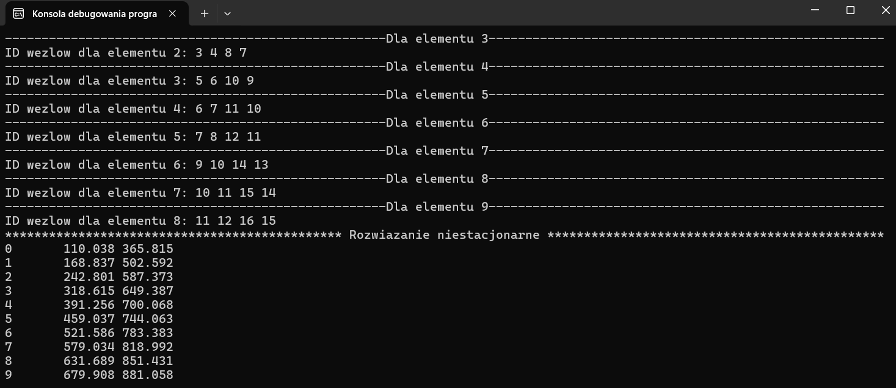

# FEM - Finite Element Method 

### Project Description
The project, solves Kirchhoff's Fourier . It is specifically designed for 2D rectangular elements, allowing the computation of temperature distribution at nodes under specified conditions.
The calculations are performed iteratively over time, and the results are displayed as the minimum and maximum temperature values for each time step.

### Technologies
**Programming language**: C++

### Features
- Computes temperature distribution at nodes based on given conditions.
- Solves the equation iteratively over time.
- Displays results as minimum and maximum temperature values at each time step.
- Supports input data from .txt files.

### Usage Instructions

1. **Prepare the Input**
   - Create or provide a `.txt` input file containing the appropriate data required for your simulation:
     - Nodes and elements data.
     - Material properties.
     - Boundary conditions.
     - Initial temperature and simulation parameters.

2. **Build the Project**
   - Open a terminal (PowerShell, CMD, Git Bash).
   - Navigate to the project folder (where `Makefile` is located).
   - Build the project using:
     ```bash
     make
     ```

3. **Run the Program**
   - After compilation, run the executable using:
     ```bash
     ./MES.exe
     ```
     or in Windows PowerShell:
     ```bash
     .\MES.exe
     ```

4. **View Results**
   - The program will output the results to the terminal.
   - It will display:
     - The minimum and maximum temperatures at each time step.
     - Additional debug information if enabled.

5. **Clean Up**
   - To clean compiled files:
     ```bash
     make clean
     ```

---

### Notes
- Ensure you have `g++` installed and accessible from your terminal.
- You can modify the input `.txt` file to test different configurations without recompiling the program.



